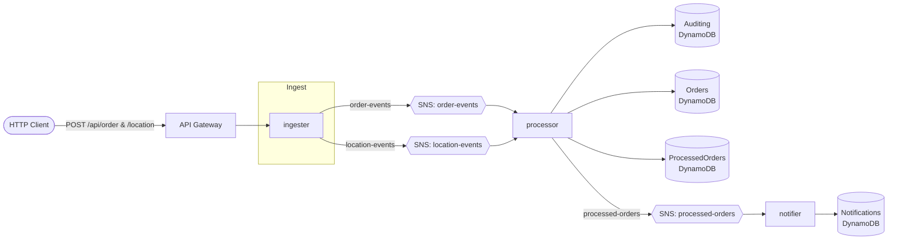

# Delivery Tracker — Distributed, Event-Driven Order Pipeline in Go

A real-time delivery-tracking pipeline built as three decoupled Go microservices communicating
asynchronously. It demonstrates event-driven architecture, hexagonal (ports & adapters) design,
graceful shutdown, and a **pluggable messaging backend** that runs on **Kafka locally** and
deploys **serverless on AWS (SNS + Lambda + API Gateway + DynamoDB)** — entirely within the AWS
Free Tier.

> The system models the "delivery update" slice of a food-delivery platform (à la iFood/Uber
> Eats): it ingests order and driver-location events, computes delivery state and ETA, and
> notifies the customer — reliably and asynchronously.

---

## Architecture



- **ingester** — accepts HTTP requests, validates them, and publishes `order-events` /
  `location-events`.
- **processor** — consumes those events, applies the domain rules (delivery state machine +
  haversine ETA), persists to DynamoDB, and publishes `processed-orders`.
- **notifier** — consumes `processed-orders` and records a customer notification.

### Two runtimes, one codebase

Each service selects its runtime from the `APP_RUNTIME` environment variable:

| `APP_RUNTIME` | Runtime | Messaging | Entry point |
|---|---|---|---|
| unset / `local` | long-running process | Apache Kafka | HTTP server (ingester) / consumer loops (processor, notifier) |
| `lambda` | single-invocation AWS Lambda | Amazon SNS | API Gateway handler / SNS handlers |

The domain and application layers never change between the two — only the infrastructure
adapters bound in `main.go` do. This is the payoff of the ports & adapters design.

---

## Tech stack

| Concern | Choice |
|---|---|
| Language | Go 1.26 |
| Messaging (local) | Apache Kafka (`segmentio/kafka-go`) |
| Messaging (AWS) | Amazon SNS (`aws-sdk-go-v2`) |
| Compute (AWS) | AWS Lambda (`aws-lambda-go`, `provided.al2023`, x86_64) |
| HTTP (local) | Gin |
| HTTP (AWS) | API Gateway (HTTP API) |
| Persistence | Amazon DynamoDB |
| IaC | AWS SAM |
| Tests | stdlib `testing`, `testify`, `testcontainers-go` |
| Local orchestration | Docker Compose |

---

## Repository layout

```
cmd/
  ingester/     # HTTP -> SNS/Kafka  (main.go + lambda.go)
  processor/    # events -> DynamoDB + processed-orders
  notifier/     # processed-orders -> DynamoDB
internal/
  ingester/     # app services, DTOs, HTTP + queue adapters
  processor/    # domain (order, delivery, ETA), app services, Dynamo + messaging adapters
  notifier/     # app service, Dynamo repo, messaging adapters
template.yaml   # AWS SAM: SNS topics, DynamoDB tables, 3 Lambdas, HTTP API
Makefile        # local build/test + SAM lambda build targets
docker-compose.yml
```

Each service has its own README with details:
[ingester](internal/ingester/README.md) ·
[processor](internal/processor/README.md) ·
[notifier](internal/notifier/README.md).

---

## Running locally (Kafka)

```bash
docker compose up --build
```

This starts Kafka, Kafka UI (`localhost:8081`), and the three services. The ingester listens on
`localhost:8080`.

DynamoDB access in local mode uses the `delivery-processor` AWS profile; point it at real tables
or [dynamodb-local](https://hub.docker.com/r/amazon/dynamodb-local) as you prefer.

## Deploying to AWS (serverless)

Requires the AWS SAM CLI and credentials.

```bash
make deploy          # sam build && sam deploy --guided
```

SAM provisions the SNS topics, four DynamoDB tables (on-demand), the HTTP API, and the three
Lambdas with least-privilege IAM. The API base URL is printed as the `ApiEndpoint` output.

---

## API examples

```bash
# Register an order
curl -X POST "$API/api/order" -H 'Content-Type: application/json' -d '{
  "event_id": "11111111-1111-1111-1111-111111111111",
  "order": {
    "id": "22222222-2222-2222-2222-222222222222",
    "client_id": "33333333-3333-3333-3333-333333333333",
    "products": [{"product_id":"44444444-4444-4444-4444-444444444444","name":"Pizza","price":4990,"quantity":1}],
    "destination": {"lat": -23.5505, "lng": -46.6333},
    "status": "NEW"
  },
  "transaction_type": "CREATE"
}'

# Push a driver location for that order
curl -X POST "$API/api/order/22222222-2222-2222-2222-222222222222/location" \
  -H 'Content-Type: application/json' -d '{
  "event_id": "55555555-5555-5555-5555-555555555555",
  "order_id": "22222222-2222-2222-2222-222222222222",
  "latitude": -23.5600,
  "longitude": -46.6400
}'
```

Both return `202 Accepted` (fire-and-forget). `GET $API/api/health` returns `200`.

---

## Design decisions

- **Ports & adapters (hexagonal).** Messaging and persistence are interfaces (`EventPublisher`,
  `OrderReader`, `NotificationWriter`, the repository ports). Kafka and SNS are interchangeable
  adapters; swapping them is a one-line change in `main.go`.
- **Pluggable messaging backend.** Kafka keeps a rich, inspectable local dev loop; SNS makes the
  AWS deployment serverless and free-tier friendly. Both satisfy the same ports.
- **Single-invocation Lambdas.** On AWS each service processes one API request / SNS delivery per
  invocation — no idle compute cost.
- **Graceful shutdown as flush.** The repositories and the processed-orders writer use a buffered
  worker (`Add`/`RunWorker`/`StopWorker`). Locally this drains in-flight work on SIGTERM; under
  Lambda the same `StopWorker` flushes buffered writes before the invocation returns. One
  mechanism, two runtimes.
- **DynamoDB key design.** Processed orders and notifications use `OrderId` (partition) +
  `Timestamp` (sort), keeping a per-order history and enabling "latest state" queries.

---

## Scope

This is an MVP focused on the event pipeline and a real, no-cost AWS deployment. The original
project brief also called for full observability (OpenTelemetry/Prometheus/Jaeger), PostgreSQL +
migrations, and DLQ/retry — deliberately out of scope here and tracked for a later iteration.
